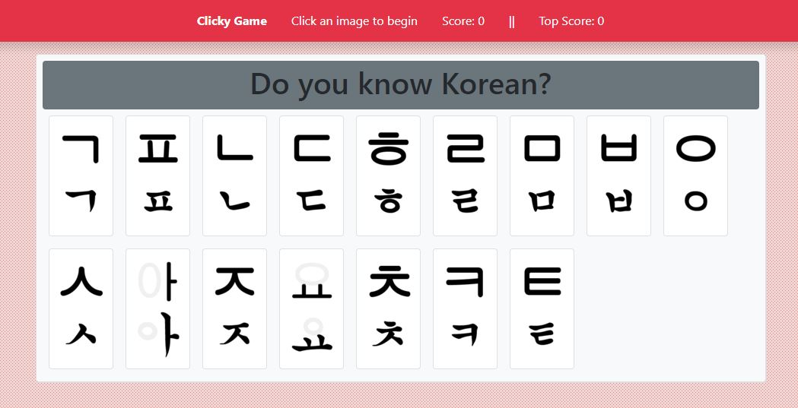
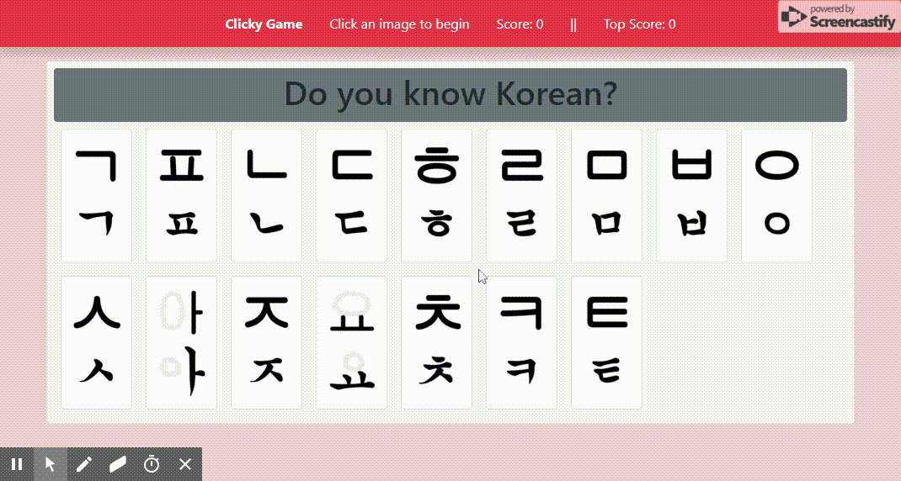
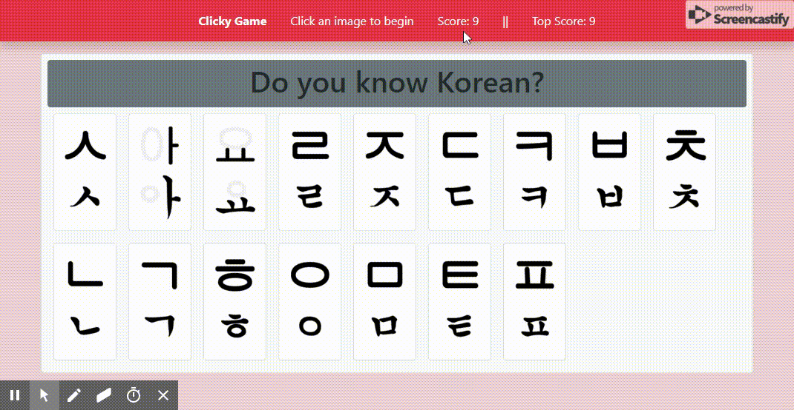

# Clicky-game
A simple card memory game made with React

## How to Play:
There are 16 cards randomly displayed on the page. Your goal is to choose 10 different cards and finish the game. 

Each time you choose a card, it checks if the card has been clicked before or not, updates the score, checks if the game has ended and continues if it hasn't.

## Top Score Tracker:
The game also keeps track of the user's top score. If the user loses, it will keep track of the user's highest reached score for the next game.

